# StocKKnock - AI 기반 통합 주식 분석 플랫폼

국내·해외 주식 투자자를 위한 AI 기반 주식 분석 플랫폼입니다. 실시간 주가 정보, AI 뉴스 분석, 포트폴리오 관리, 가격 알림 등 종합적인 투자 도구를 제공합니다.

---

## 📋 목차

- [주요 기능](#-주요-기능)
- [기술 스택](#-기술-스택)
- [프로젝트 구조](#-프로젝트-구조)
- [데이터베이스 스키마](#-데이터베이스-스키마)
- [시작하기](#-시작하기)
- [환경 변수 설정](#-환경-변수-설정)
- [외부 API 연동](#-외부-api-연동)
- [API 엔드포인트](#-api-엔드포인트)
- [개발 가이드](#-개발-가이드)

---

## ✨ 주요 기능

### 📈 실시간 주가 정보
- 국내·해외 주요 증시 주식 정보 조회
- Yahoo Finance, Alpha Vantage, Twelve Data API를 통한 자동 가격 업데이트
- **시장 개장 시간에만 자동 갱신** (평일 09:00-15:30, 매 1분마다)
- 비용 최적화를 위한 스마트 업데이트 스케줄링

### 📰 오늘의 시장 브리핑
- **GPT 기반 일일 시장 요약** (하루 1회 생성)
- 사용자 관심 종목을 반영한 맞춤형 브리핑
- 장 시작 전 자동 생성 (스케줄러)
- 실패 시에도 기본 메시지 제공 (서비스 안정성)
- 전역 공유 콘텐츠 (모든 사용자 동일 브리핑)

### 📊 포트폴리오 관리
- 보유 종목 관리 (추가/수정/삭제)
- 실시간 손익 계산 (손익금액, 손익률)
- 총 평가액 및 총 손익 추적
- **AI 기반 포트폴리오 종합 분석 (캐싱 최적화)**
  - 포트폴리오 구성 변경 시에만 AI 재분석 (해시 기반 감지)
  - 사용자별 1개 분석 결과만 유지 (DB 저장)
  - 포트폴리오 요약 (총 평가액, 총 손익, 수익률)
  - 핵심 해석 (수익 상태, 리스크 요인)
  - 투자자가 고려해볼 선택지 (객관적, 중립적 톤)
  - 불필요한 GPT API 호출 방지로 비용 절감

### 🔔 가격 알림
- 목표가 도달 알림
- 손절가 도달 알림
- 변동률 기준 알림
- 이메일 알림 발송 (선택사항)
- **매 30초마다 알림 조건 체크** (서버 부하 최적화)

### 💬 AI 채팅
- 문맥을 유지하는 대화형 AI 애널리스트
- 최근 5개 대화 기록 기반 문맥 유지
- 질문 의도 정확히 파악하여 직접적인 답변 제공
- 일반 개념 질문과 특정 종목 질문 구분 처리
- 종목 전망, 산업 동향, 리스크 분석 등 다양한 질문 지원
- 대화 기록 자동 저장

### 📰 뉴스 피드
- 최근 7일 뉴스 조회 (기본값, 조정 가능)
- 뉴스별 상세 정보 및 AI 분석 결과
- 종목별 연관 뉴스 필터링
- 주요 종목 뉴스 자동 수집 (매일 오전 9시)

### ⭐ 관심 종목
- 관심 종목 추가/삭제
- 사용자별 관심 종목 목록 관리

### 🔐 사용자 인증 및 계정 관리
- **아이디 기반 회원가입 및 로그인**
- JWT 토큰 기반 인증
- **마이페이지 - 개인정보 관리**
  - 아이디 변경 (비밀번호 확인 필요)
  - 닉네임 변경
  - 이메일 변경 (보안 강화된 인증 코드 기반)
    - 새 이메일로 6자리 인증 코드 전송 (10분 유효)
    - 인증 코드 확인 및 현재 비밀번호 검증 후 이메일 변경
    - 보안을 위한 2단계 인증 프로세스
    - 만료된 인증 코드 자동 정리 (스케줄러)
  - 비밀번호 변경 (현재 비밀번호 확인 필요)

---

## 🛠 기술 스택

### Backend (knockBE)
- **언어**: Java 17
- **프레임워크**: Spring Boot 4.0.0
- **데이터베이스**: PostgreSQL 12+
- **ORM**: Spring Data JPA (Hibernate)
- **보안**: Spring Security + JWT
- **AI**: OpenAI GPT-4 API (gpt-4o-mini 기본값)
  - 백엔드에서 직접 GPT API 호출 (OpenAiService)
  - FastAPI 폴백 지원
  - **주의**: Jackson 2.x 버전 사용 (OpenAiService 라이브러리 호환성)
  - `build.gradle`에서 Jackson 2.17.2 강제 사용
- **스케줄러**: Spring Scheduling
- **HTTP 클라이언트**: Spring WebFlux (WebClient)
- **이메일**: Spring Mail (Gmail SMTP)
- **API 문서**: SpringDoc OpenAPI (Swagger UI)
- **빌드 도구**: Gradle

### Frontend (knockFE)
- **언어**: TypeScript
- **프레임워크**: React 19
- **빌드 도구**: Vite
- **라우팅**: React Router v7
- **상태 관리**: TanStack Query (React Query)
- **HTTP 클라이언트**: Axios
- **차트**: Recharts

### 외부 API
- **주가 정보**: Yahoo Finance, Alpha Vantage, Twelve Data
- **뉴스**: NewsAPI
- **AI**: OpenAI GPT-4
- **이메일**: Gmail SMTP

---

## 📁 프로젝트 구조

### Backend 구조 (기능별 패키지)

```
knockBE/src/main/java/com/sxxm/stockknock/
├── auth/                    # 인증 관련
│   ├── controller/         # AuthController
│   ├── service/            # UserService, EmailVerificationService
│   ├── repository/         # UserRepository, EmailVerificationRepository
│   ├── entity/             # User, EmailVerification
│   └── dto/                # AuthRequest, AuthResponse, UserDto, EmailChangeRequest
│
├── stock/                   # 주식 관련
│   ├── controller/         # StockController
│   ├── service/            # StockService, StockPriceService
│   ├── repository/         # StockRepository, StockPriceHistoryRepository
│   ├── entity/             # Stock, StockPriceHistory
│   ├── dto/                # StockDto
│   └── scheduler/          # StockPriceScheduler
│
├── portfolio/              # 포트폴리오 관련
│   ├── controller/         # PortfolioController
│   ├── service/            # PortfolioService
│   ├── repository/         # PortfolioRepository, PortfolioItemRepository
│   ├── entity/             # Portfolio, PortfolioItem
│   └── dto/                # PortfolioDto, PortfolioAnalysisDto
│
├── news/                   # 뉴스 관련
│   ├── controller/         # NewsController
│   ├── service/            # NewsService, NewsCrawlerService, NewsStockAssociationService
│   ├── repository/         # NewsRepository, NewsAnalysisRepository, NewsStockRelationRepository
│   ├── entity/             # News, NewsAnalysis, NewsStockRelation
│   ├── dto/                # NewsDto, NewsAnalysisDto
│   └── scheduler/          # NewsCrawlerScheduler
│
├── alert/                  # 가격 알림 관련
│   ├── controller/         # PriceAlertController
│   ├── service/            # NotificationService
│   ├── repository/         # PriceAlertRepository
│   ├── entity/             # PriceAlert
│   └── scheduler/          # PriceAlertScheduler
│
├── watchlist/              # 관심 종목 관련
│   ├── controller/         # WatchlistController
│   ├── repository/         # WatchlistRepository
│   └── entity/             # Watchlist
│
├── ai/                     # AI 관련
│   ├── controller/         # AIController
│   ├── service/            # AIService
│   ├── repository/         # AIConversationRepository
│   ├── entity/             # AIConversation
│   └── dto/                # AIChatRequest, AIChatResponse
│
└── common/                 # 공통 기능
    ├── config/             # SecurityConfig, ValidationConfig, WebConfig
    ├── security/           # JwtAuthenticationFilter
    └── util/                # JwtUtil
```

### Frontend 구조

```
knockFE/src/
├── api/                    # API 클라이언트
│   ├── client.ts          # Axios 인스턴스 (Spring Boot)
│   ├── fastApiClient.ts   # FastAPI 클라이언트 (내부 사용)
│   ├── auth.ts            # 인증 API
│   ├── stock.ts           # 주식 API
│   ├── portfolio.ts      # 포트폴리오 API
│   ├── news.ts            # 뉴스 API (Spring Boot)
│   ├── ai.ts              # AI API (Spring Boot)
│   ├── watchlist.ts       # 관심 종목 API
│   └── alerts.ts          # 가격 알림 API
│
├── pages/                  # 페이지 컴포넌트
│   ├── Login.tsx          # 로그인 페이지
│   ├── Dashboard.tsx      # 대시보드
│   ├── Portfolio.tsx     # 포트폴리오
│   ├── News.tsx           # 뉴스
│   ├── AIChat.tsx         # AI 채팅
│   ├── EmailChange.tsx    # 이메일 변경
│   └── MyPage.tsx         # 마이페이지
│
├── context/                # Context API
│   └── AuthContext.tsx   # 인증 컨텍스트
│
└── assets/                  # 정적 파일
```

---

## 🗄 데이터베이스 스키마

### 전체 스키마 다이어그램

```mermaid
erDiagram
    users ||--o{ portfolios : has
    users ||--o{ watchlists : has
    users ||--o{ price_alerts : has
    users ||--o{ ai_conversations : has
    users ||--o{ email_verifications : has
    
    portfolios ||--o{ portfolio_items : contains
    stocks ||--o{ portfolio_items : "held in"
    stocks ||--o{ watchlists : "watched in"
    stocks ||--o{ price_alerts : "alerted for"
    stocks ||--o{ stock_price_history : "has history"
    stocks }o--o{ news_stock_relations : "related to"
    
    news ||--|| news_analyses : "analyzed by"
    news ||--o{ news_stock_relations : "related to"
    
    users {
        bigint id PK
        string email UK "unique, not null"
        string password "not null"
        string nickname
        timestamp created_at
    }
    
    stocks {
        string symbol PK "종목 코드 (예: AAPL, 005930)"
        string name "not null"
        string exchange "NYSE, NASDAQ, KOSPI, KOSDAQ"
        string country "US, KR"
        string industry
        string currency
        timestamp created_at
        timestamp updated_at
    }
    
    stock_price_history {
        bigint id PK
        string stock_symbol FK
        decimal price "not null"
        decimal open
        decimal high
        decimal low
        bigint volume
        timestamp timestamp "not null"
        timestamp created_at
    }
    
    portfolios {
        bigint id PK
        bigint user_id FK "not null"
        string name "Default Portfolio"
        timestamp created_at
    }
    
    portfolio_items {
        bigint id PK
        bigint portfolio_id FK "not null"
        string stock_symbol FK "not null"
        decimal quantity "not null"
        decimal avg_buy_price "not null"
        timestamp created_at
        timestamp updated_at
    }
    
    news {
        bigint id PK
        text title "not null"
        text content
        string url
        string source
        timestamp published_at
        timestamp created_at
    }
    
    news_analyses {
        bigint news_id PK "FK to news.id"
        text summary "AI 요약"
        string sentiment "positive, negative, neutral"
        integer impact_score "1-10"
        text ai_comment
        timestamp analyzed_at
    }
    
    news_stock_relations {
        bigint news_id PK "FK to news.id"
        string stock_symbol PK "FK to stocks.symbol"
        timestamp created_at
    }
    
    watchlists {
        bigint user_id PK "FK to users.id"
        string stock_symbol PK "FK to stocks.symbol"
        timestamp created_at
    }
    
    price_alerts {
        bigint id PK
        bigint user_id FK "not null"
        string stock_symbol FK "not null"
        string alert_type "TARGET, STOP_LOSS, PERCENT"
        decimal target_price
        decimal percent_change
        boolean triggered "default false"
        timestamp triggered_at
        timestamp created_at
    }
    
    ai_conversations {
        bigint id PK
        bigint user_id FK "not null"
        string role "user, assistant"
        text message "not null"
        timestamp created_at
    }
    
    email_verifications {
        bigint id PK
        string email "not null"
        string verification_code "6자리, not null"
        boolean is_verified "default false"
        timestamp expires_at "not null"
        timestamp created_at
    }
```



### 주요 테이블 상세

#### 📈 Stock 테이블

주식 기본 정보를 저장하는 핵심 테이블입니다. **종목 코드(symbol)가 기본 키**입니다.

| 컬럼명 | 타입 | 설명 | 제약조건 |
|--------|------|------|---------|
| `symbol` | VARCHAR(20) | 종목 코드 (예: AAPL, 005930) | **PK**, NOT NULL |
| `name` | VARCHAR(255) | 종목명 | NOT NULL |
| `exchange` | VARCHAR(50) | 거래소 (NYSE, NASDAQ, KOSPI, KOSDAQ) | - |
| `country` | VARCHAR(50) | 국가 (US, KR) | - |
| `industry` | VARCHAR(100) | 산업군 | - |
| `currency` | VARCHAR(10) | 통화 (USD, KRW) | - |
| `created_at` | TIMESTAMP | 생성 시간 | DEFAULT CURRENT_TIMESTAMP |
| `updated_at` | TIMESTAMP | 수정 시간 | DEFAULT CURRENT_TIMESTAMP |

**관계:**
- `One-to-Many`: StockPriceHistory (시세 히스토리)
- `One-to-Many`: PortfolioItem (포트폴리오 보유 종목)
- `Many-to-Many`: News (뉴스와 연관, news_stock_relation 테이블)

**주요 변경사항:**
- 기본 키가 `id`에서 `symbol`로 변경됨
- 실시간 가격 정보는 `stock_price_history` 테이블로 분리
- `industry_id` 외래 키 제거, `industry` 문자열 필드로 변경

#### 📊 StockPriceHistory 테이블

종목의 시세 히스토리를 저장하는 테이블입니다.

| 컬럼명 | 타입 | 설명 | 제약조건 |
|--------|------|------|---------|
| `id` | BIGINT | 기본 키 | PK, AUTO_INCREMENT |
| `stock_symbol` | VARCHAR(20) | 종목 코드 | FK → stocks.symbol, NOT NULL |
| `price` | NUMERIC(18,4) | 종가/현재가 | NOT NULL |
| `open` | NUMERIC(18,4) | 시가 | - |
| `high` | NUMERIC(18,4) | 고가 | - |
| `low` | NUMERIC(18,4) | 저가 | - |
| `volume` | BIGINT | 거래량 | - |
| `timestamp` | TIMESTAMP | 수집 시간 | NOT NULL |
| `created_at` | TIMESTAMP | 생성 시간 | DEFAULT CURRENT_TIMESTAMP |

**제약조건:**
- `UNIQUE(stock_symbol, timestamp)`: 동일 종목의 동일 시간 데이터 중복 방지

**인덱스:**
- `idx_price_history_stock_time`: 종목별 시간순 조회 최적화
- `idx_price_history_timestamp`: 전체 시간순 조회 최적화

#### 💼 Portfolio & PortfolioItem 테이블

사용자의 포트폴리오와 보유 종목을 관리합니다. 포트폴리오는 여러 종목을 포함할 수 있습니다.

**Portfolio 테이블:**

| 컬럼명 | 타입 | 설명 | 제약조건 |
|--------|------|------|---------|
| `id` | BIGINT | 기본 키 | PK, AUTO_INCREMENT |
| `user_id` | BIGINT | 사용자 ID | FK → users.id, NOT NULL |
| `name` | VARCHAR(255) | 포트폴리오 이름 | DEFAULT 'Default Portfolio' |
| `created_at` | TIMESTAMP | 생성 시간 | DEFAULT CURRENT_TIMESTAMP |

**PortfolioItem 테이블:**

| 컬럼명 | 타입 | 설명 | 제약조건 |
|--------|------|------|---------|
| `id` | BIGINT | 기본 키 | PK, AUTO_INCREMENT |
| `portfolio_id` | BIGINT | 포트폴리오 ID | FK → portfolio.id, NOT NULL |
| `stock_symbol` | VARCHAR(20) | 종목 코드 | FK → stocks.symbol, NOT NULL |
| `quantity` | NUMERIC(18,4) | 보유 수량 | NOT NULL, DEFAULT 0 |
| `avg_buy_price` | NUMERIC(18,4) | 평균 매입 단가 | NOT NULL |
| `created_at` | TIMESTAMP | 생성 시간 | DEFAULT CURRENT_TIMESTAMP |
| `updated_at` | TIMESTAMP | 수정 시간 | DEFAULT CURRENT_TIMESTAMP |

**관계:**
- `Many-to-One`: Portfolio → User (사용자)
- `One-to-Many`: Portfolio → PortfolioItem (보유 종목)
- `Many-to-One`: PortfolioItem → Stock (주식)

**계산 로직 (서비스 레이어에서 계산):**
- `current_price`: StockPriceHistory에서 최신 가격 조회
- `total_value = quantity × current_price`
- `profit_loss = total_value - (quantity × avg_buy_price)`
- `profit_loss_rate = (profit_loss / (quantity × avg_buy_price)) × 100`

**주요 변경사항:**
- 포트폴리오와 보유 종목이 분리됨 (Portfolio ↔ PortfolioItem)
- 한 사용자가 여러 포트폴리오를 가질 수 있음
- 실시간 가격 정보는 `stock_price_history`에서 조회

#### 📰 News & NewsAnalysis & NewsStockRelation 테이블

뉴스 정보, AI 분석 결과, 그리고 뉴스-종목 연관 관계를 저장합니다.

**News 테이블:**

| 컬럼명 | 타입 | 설명 | 제약조건 |
|--------|------|------|---------|
| `id` | BIGINT | 기본 키 | PK, AUTO_INCREMENT |
| `title` | TEXT | 뉴스 제목 | NOT NULL |
| `content` | TEXT | 뉴스 본문 | - |
| `url` | TEXT | 뉴스 원문 URL | - |
| `source` | VARCHAR(255) | 뉴스 출처 | - |
| `published_at` | TIMESTAMP | 발행 시간 | - |
| `created_at` | TIMESTAMP | 수집 시간 | DEFAULT CURRENT_TIMESTAMP |

**NewsAnalysis 테이블:**

| 컬럼명 | 타입 | 설명 | 제약조건 |
|--------|------|------|---------|
| `news_id` | BIGINT | 뉴스 ID (기본 키) | **PK**, FK → news.id |
| `summary` | TEXT | AI 요약 | - |
| `sentiment` | VARCHAR(20) | 감정 분석 (positive, negative, neutral) | - |
| `impact_score` | INTEGER | 영향 점수 (1-10) | CHECK (1-10) |
| `ai_comment` | TEXT | AI 코멘트 | - |
| `analyzed_at` | TIMESTAMP | 분석 시간 | DEFAULT CURRENT_TIMESTAMP |

**참고**: DTO에서는 `impactAnalysis` 필드를 사용하지만, 엔티티에서는 `aiComment` 필드를 사용합니다. 서비스 레이어에서 변환 처리됩니다.

**NewsStockRelation 테이블 (뉴스-종목 연관):**

| 컬럼명 | 타입 | 설명 | 제약조건 |
|--------|------|------|---------|
| `news_id` | BIGINT | 뉴스 ID | **PK**, FK → news.id |
| `stock_symbol` | VARCHAR(20) | 종목 코드 | **PK**, FK → stocks.symbol |
| `created_at` | TIMESTAMP | 생성 시간 | DEFAULT CURRENT_TIMESTAMP |

**관계:**
- `One-to-One`: News → NewsAnalysis (한 뉴스당 하나의 분석)
- `One-to-Many`: News → NewsStockRelation (뉴스와 여러 종목 연관)
- `Many-to-Many`: News ↔ Stock (news_stock_relation 테이블을 통한 연관)

**주요 변경사항:**
- `NewsAnalysis.news_id`가 기본 키로 변경 (One-to-One 관계)
- `impact_analysis` 필드 제거, `ai_comment` 필드 추가
- `news_stocks` 테이블이 `news_stock_relation`으로 변경, `stock_id` 대신 `stock_symbol` 사용

### 제거된 테이블 (불필요한 기능 제거)

다음 테이블들은 프로젝트 최적화 과정에서 제거되었습니다:

- **`industries`**: 산업 정보를 별도 테이블로 관리하지 않고 `stocks.industry` 필드에 문자열로 저장
- **`stock_predictions`**: AI 예측 기능 제거 (향후 필요 시 재추가 가능)
- **`earnings_calendar`**: 실적 발표 일정 기능 제거 (향후 필요 시 재추가 가능)
- **`stock_recommendations`**: 종목 추천 기능 제거 (향후 필요 시 재추가 가능)
- **`portfolio_reports`**: 포트폴리오 리포트 기능 제거 (AI 분석으로 대체)

**제거 이유:**
- 불필요한 복잡도 감소
- 데이터베이스 스키마 단순화
- 유지보수 비용 절감
- 핵심 기능에 집중

---

### 기타 주요 테이블

#### 👤 Users

사용자 인증 및 프로필 정보를 저장합니다.

| 컬럼명 | 타입 | 설명 | 제약조건 |
|--------|------|------|---------|
| `id` | BIGINT | 기본 키 | PK, AUTO_INCREMENT |
| `username` | VARCHAR(255) | 아이디 (로그인 ID) | **UK**, NOT NULL |
| `email` | VARCHAR(255) | 이메일 | **UK**, NOT NULL |
| `password` | VARCHAR(255) | 비밀번호 (암호화) | NOT NULL |
| `nickname` | VARCHAR(255) | 닉네임 | - |
| `created_at` | TIMESTAMP | 생성 시간 | DEFAULT CURRENT_TIMESTAMP |

**주요 변경사항:**
- **아이디 기반 로그인**: `username` 필드로 로그인 (이메일과 별도)
- **이메일과 아이디 분리**: 이메일은 통신용, 아이디는 로그인용
- **마이페이지 기능**: 아이디, 닉네임, 이메일, 비밀번호 변경 지원
- **이메일 변경 기능**: `EmailVerification` 테이블을 통한 인증 코드 기반 이메일 변경 지원

#### 🔐 EmailVerification

이메일 변경을 위한 인증 코드를 저장합니다.

| 컬럼명 | 타입 | 설명 | 제약조건 |
|--------|------|------|---------|
| `id` | BIGINT | 기본 키 | PK, AUTO_INCREMENT |
| `email` | VARCHAR(255) | 인증 대상 이메일 | NOT NULL |
| `verification_code` | VARCHAR(6) | 6자리 랜덤 인증 코드 | NOT NULL |
| `is_verified` | BOOLEAN | 인증 완료 여부 | DEFAULT FALSE |
| `expires_at` | TIMESTAMP | 만료 시간 | NOT NULL (생성 후 10분) |
| `created_at` | TIMESTAMP | 생성 시간 | DEFAULT CURRENT_TIMESTAMP |

**보안 기능:**
- 인증 코드는 6자리 랜덤 숫자 (100000 ~ 999999)
- 인증 코드는 10분간 유효 (만료 후 자동 무효화)
- 만료된 코드는 스케줄러로 매일 자정에 자동 정리
- 한 이메일당 하나의 미인증 코드만 유지 (새 코드 생성 시 기존 미인증 코드 삭제)
- 인증 완료 후 `is_verified`가 `true`로 설정되어 재사용 방지

**인증 프로세스:**
1. 사용자가 새 이메일 입력 → 인증 코드 전송 요청
2. 시스템이 6자리 랜덤 코드 생성 → 새 이메일로 전송
3. 사용자가 인증 코드 입력 + 현재 비밀번호 입력
4. 시스템이 인증 코드 유효성 검증 (만료 시간, 일치 여부)
5. 비밀번호 확인 후 이메일 변경 완료

#### 🔔 PriceAlerts

가격 알림 설정을 저장합니다.

| 컬럼명 | 타입 | 설명 | 제약조건 |
|--------|------|------|---------|
| `id` | BIGINT | 기본 키 | PK, AUTO_INCREMENT |
| `user_id` | BIGINT | 사용자 ID | FK → users.id, NOT NULL |
| `stock_symbol` | VARCHAR(20) | 종목 코드 | FK → stocks.symbol, NOT NULL |
| `alert_type` | VARCHAR(20) | 알림 타입 | NOT NULL (TARGET, STOP_LOSS, PERCENT) |
| `target_price` | NUMERIC(18,4) | 목표가 | - |
| `percent_change` | NUMERIC(5,2) | 변동률 (%) | - |
| `triggered` | BOOLEAN | 트리거 여부 | DEFAULT FALSE |
| `triggered_at` | TIMESTAMP | 트리거 시간 | - |
| `created_at` | TIMESTAMP | 생성 시간 | DEFAULT CURRENT_TIMESTAMP |

**주요 변경사항:**
- `stock_id` 대신 `stock_symbol` 사용 (Stock 테이블의 PK 변경에 따른 수정)
- `alert_type`이 ENUM에서 VARCHAR로 변경 (유연성 향상)
- `percentage_change` → `percent_change`로 필드명 변경
- `isTriggered` → `triggered`로 필드명 변경 (Boolean 타입 네이밍 통일)

#### ⭐ Watchlists

사용자별 관심 종목 목록을 저장합니다.

| 컬럼명 | 타입 | 설명 | 제약조건 |
|--------|------|------|---------|
| `user_id` | BIGINT | 사용자 ID | **PK**, FK → users.id |
| `stock_symbol` | VARCHAR(20) | 종목 코드 | **PK**, FK → stocks.symbol |
| `created_at` | TIMESTAMP | 추가 시간 | DEFAULT CURRENT_TIMESTAMP |

**주요 변경사항:**
- 복합 기본 키 사용 (`user_id`, `stock_symbol`) - `@IdClass` 사용
- `stock_id` 대신 `stock_symbol` 사용 (Stock 테이블의 PK 변경에 따른 수정)
- 한 사용자가 동일 종목을 중복 추가할 수 없음 (복합 키 제약)

#### 💬 AIConversations

AI 채팅 대화 기록을 저장합니다.

| 컬럼명 | 타입 | 설명 | 제약조건 |
|--------|------|------|---------|
| `id` | BIGINT | 기본 키 | PK, AUTO_INCREMENT |
| `user_id` | BIGINT | 사용자 ID | FK → users.id, NOT NULL |
| `role` | VARCHAR(10) | 역할 | NOT NULL (user, assistant) |
| `message` | TEXT | 메시지 내용 | NOT NULL |
| `created_at` | TIMESTAMP | 생성 시간 | DEFAULT CURRENT_TIMESTAMP |

**주요 변경사항:**
- `userQuestion`, `aiResponse` 필드 제거
- `role` (user/assistant), `message` 필드로 채팅 구조로 변경
- 대화 기록이 순차적으로 저장되어 문맥 유지 가능
- 최근 5개 대화 기록을 기반으로 AI가 문맥을 이해하고 응답

---

## 🚀 시작하기

### 사전 요구사항

- **Java**: 17 이상
- **Node.js**: 18 이상
- **PostgreSQL**: 12 이상
- **Gradle**: 7.0 이상 (또는 Gradle Wrapper 사용)

### 1. 저장소 클론

```bash
git clone <repository-url>
cd stockknock
```

### 2. 데이터베이스 설정

PostgreSQL 데이터베이스 생성:

```sql
CREATE DATABASE stockknockdb;
CREATE USER sxxm WITH PASSWORD 'sxxmpass';
GRANT ALL PRIVILEGES ON DATABASE stockknockdb TO sxxm;
```

또는 `application.properties`에서 데이터베이스 설정을 수정하세요.

### 3. 환경 변수 설정

프로젝트 루트에 `.env` 파일을 생성하고 필요한 환경 변수를 설정하세요:

```bash
# ============================================
# 보안 설정 (필수)
# ============================================
# ⚠️ SKJWT_SECRET은 반드시 64 bytes 이상이어야 합니다!
# 생성 방법: openssl rand -base64 64 | tr -d '\n'
SKJWT_SECRET=<생성된-64-byte-이상-키>

# ============================================
# OpenAI API (필수)
# ============================================
OPENAI_API_KEY=your-openai-api-key
GPT_MODEL=gpt-4o-mini
GPT_API_URL=https://api.openai.com/v1/chat/completions

# ============================================
# 이메일 설정 (선택사항)
# ============================================
# 방법 1: App Password 사용
MAIL_USERNAME=your-email@gmail.com
MAIL_PASSWORD=your-16-digit-app-password

# 방법 2: OAuth2 사용 (권장, 더 안전)
# GMAIL_OAUTH2_CLIENT_ID=your-oauth2-client-id
# GMAIL_OAUTH2_CLIENT_SECRET=your-oauth2-client-secret
# GMAIL_OAUTH2_REFRESH_TOKEN=your-oauth2-refresh-token

NOTIFICATION_EMAIL_ENABLED=false

# ============================================
# 주가 API (선택사항, 백업용)
# ============================================
ALPHA_VANTAGE_API_KEY=your-alpha-vantage-key
TWELVE_DATA_API_KEY=your-twelve-data-key

# ============================================
# 뉴스 API (선택사항)
# ============================================
NEWS_API_KEY=your-newsapi-key
```

> 💡 **보안 팁**: 
> - 프로덕션 환경에서는 `application-prod.properties` 사용
> - 모든 민감한 정보는 환경 변수로 관리
> - `.env` 파일은 절대 Git에 커밋하지 마세요!

### 4. Backend 실행

```bash
cd knockBE

# Gradle Wrapper 사용 (권장)
./gradlew bootRun

# 또는 직접 실행
gradle bootRun
```

Backend는 기본적으로 `http://localhost:8080`에서 실행됩니다.

**Swagger UI 접속:**
- `http://localhost:8080/swagger-ui.html` - API 문서 및 테스트 인터페이스
- `http://localhost:8080/v3/api-docs` - OpenAPI JSON 스펙

### 5. Frontend 실행

```bash
cd knockFE

# 의존성 설치
npm install

# 개발 서버 실행
npm run dev
```

Frontend는 기본적으로 `http://localhost:5173`에서 실행됩니다 (Vite 기본 포트).

### 6. FastAPI 실행 (선택사항, 내부 서비스)

FastAPI는 Spring Boot에서 내부적으로 호출하는 서비스입니다. 개발 환경에서 테스트하려면:

```bash
cd knockAI
source venv/bin/activate
uvicorn app.main:app --reload --host 0.0.0.0 --port 8000
```

**참고**: 프론트엔드는 Spring Boot API만 호출하며, FastAPI는 백엔드 내부 서비스로만 사용됩니다.

### 7. 빠른 시작 스크립트

프로젝트 루트에 `quick_start.sh` 스크립트를 사용할 수 있습니다:

```bash
chmod +x quick_start.sh
./quick_start.sh
```

### 8. Swagger UI 접속

백엔드가 실행되면 Swagger UI에 접속할 수 있습니다:

- **Swagger UI**: `http://localhost:8080/swagger-ui.html`
- **API Docs (JSON)**: `http://localhost:8080/v3/api-docs`

---

## 🔐 환경 변수 설정

### ⚠️ 보안 중요 사항

#### 1. SKJWT_SECRET 설정 (필수)
**SKJWT_SECRET은 반드시 64 bytes 이상이어야 합니다!**

```bash
# 안전한 SKJWT_SECRET 생성 방법
openssl rand -base64 64 | tr -d '\n'
```

생성된 키를 `.env` 파일에 설정하세요:
```bash
SKJWT_SECRET=<생성된-64-byte-이상-키>
```

#### 2. 환경 분리
- **개발 환경**: `application.properties` 사용
- **프로덕션 환경**: `application-prod.properties` 사용
  ```bash
  # 프로덕션 실행 시
  java -jar app.jar --spring.profiles.active=prod
  ```

#### 3. Gmail SMTP 보안 설정
**방법 1: App Password 사용 (간단)**
1. Gmail 설정 > 보안 > 2단계 인증 활성화
2. 앱 비밀번호 생성
3. 생성된 16자리 비밀번호를 `MAIL_PASSWORD`에 설정

**방법 2: OAuth2 사용 (권장, 더 안전)**
- `application-prod.properties`의 OAuth2 설정 참고
- Google Cloud Console에서 OAuth2 클라이언트 생성 필요

### 필수 환경 변수

| 변수명 | 설명 | 예시 | 보안 요구사항 |
|--------|------|------|-------------|
| `SKJWT_SECRET` | JWT 토큰 서명 키 | `openssl rand -base64 64` | **64 bytes 이상 필수** |
| `OPENAI_API_KEY` | OpenAI API 키 | `sk-...` | - |

### 선택적 환경 변수

#### 이메일 알림

| 변수명 | 설명 | 기본값 | 보안 권장사항 |
|--------|------|--------|-------------|
| `MAIL_USERNAME` | Gmail 주소 | - | - |
| `MAIL_PASSWORD` | Gmail 앱 비밀번호 | - | App Password 또는 OAuth2 권장 |
| `NOTIFICATION_EMAIL_ENABLED` | 이메일 알림 활성화 | `false` | - |
| `GMAIL_OAUTH2_CLIENT_ID` | Gmail OAuth2 클라이언트 ID | - | OAuth2 사용 시 필수 |
| `GMAIL_OAUTH2_CLIENT_SECRET` | Gmail OAuth2 클라이언트 시크릿 | - | OAuth2 사용 시 필수 |
| `GMAIL_OAUTH2_REFRESH_TOKEN` | Gmail OAuth2 리프레시 토큰 | - | OAuth2 사용 시 필수 |

#### 주가 API (백업용)

| 변수명 | 설명 | 기본값 |
|--------|------|--------|
| `ALPHA_VANTAGE_API_KEY` | Alpha Vantage API 키 | - |
| `TWELVE_DATA_API_KEY` | Twelve Data API 키 | - |

#### 뉴스 API

| 변수명 | 설명 | 기본값 |
|--------|------|--------|
| `NEWS_API_KEY` | NewsAPI 키 | - |

#### GPT 설정

| 변수명 | 설명 | 기본값 |
|--------|------|--------|
| `GPT_MODEL` | 사용할 GPT 모델 | `gpt-4o-mini` |
| `GPT_API_URL` | GPT API 엔드포인트 | `https://api.openai.com/v1/chat/completions` |

---

## 🔌 외부 API 연동

### 📊 주가 API (Stock Price APIs)

StocKKnock은 여러 주가 API를 지원하며, 우선순위에 따라 자동으로 폴백(fallback)합니다.

#### 1. Yahoo Finance (기본, 무료) ⭐

**우선순위: 1순위 (기본 사용)**

- **URL**: `https://query1.finance.yahoo.com/v8/finance/chart/{symbol}`
- **API 키**: 불필요 (무료)
- **제한**: 초당 2회 요청
- **설정**: `application.properties` → `stock.api.yahoo-finance.enabled=true` (기본값)
- **용도**: 주식 가격, 일일 고가/저가, 거래량 등 실시간 정보
- **장점**: 무료, API 키 불필요, 안정적
- **단점**: 비공식 API (공식 지원 없음)

**사용 방법:**
- 별도 설정 불필요, 기본적으로 활성화됨
- `StockPriceService`에서 자동으로 사용

#### 2. Alpha Vantage (백업 옵션)

**우선순위: 2순위 (Yahoo Finance 실패 시)**

- **URL**: `https://www.alphavantage.co/query`
- **API 키**: 필수 (환경 변수 `ALPHA_VANTAGE_API_KEY`)
- **제한**: 
  - 무료 플랜: 일일 25회 요청
  - 분당 5회 요청
- **설정**: `application.properties` → `stock.api.alpha-vantage.key=${ALPHA_VANTAGE_API_KEY:}`
- **용도**: 주식 가격, 전일 종가, 고가/저가, 거래량
- **장점**: 공식 API, 안정적
- **단점**: 무료 플랜 제한이 엄격함

**설정 방법:**
1. [Alpha Vantage](https://www.alphavantage.co/support/#api-key)에서 API 키 발급
2. 환경 변수 `ALPHA_VANTAGE_API_KEY` 설정
3. 백엔드 재시작

#### 3. Twelve Data (백업 옵션)

**우선순위: 3순위 (Yahoo Finance, Alpha Vantage 실패 시)**

- **URL**: `https://api.twelvedata.com/price`
- **API 키**: 필수 (환경 변수 `TWELVE_DATA_API_KEY`)
- **제한**: 무료 플랜 일일 800회 요청
- **설정**: `application.properties` → `stock.api.twelve-data.key=${TWELVE_DATA_API_KEY:}`
- **용도**: 주식 가격 조회
- **장점**: 무료 플랜 제한이 넉넉함
- **단점**: 기본 가격 정보만 제공 (고가/저가 등 제한적)

**설정 방법:**
1. [Twelve Data](https://twelvedata.com/) 회원가입
2. Dashboard에서 API 키 확인
3. 환경 변수 `TWELVE_DATA_API_KEY` 설정
4. 백엔드 재시작

#### 4. FastAPI (내부 서비스)

**용도**: 주가 조회 및 업데이트 (내부 처리)

- **URL**: `http://localhost:8000/api/stock/{symbol}/price`
- **설정**: `application.properties` → `fastapi.base-url=${FASTAPI_BASE_URL:http://localhost:8000}`
- **용도**: Spring Boot에서 내부적으로 호출하는 주가 조회 서비스
- **참고**: 프론트엔드는 직접 호출하지 않음

**주가 API 우선순위:**
```
Yahoo Finance (기본) 
  → Alpha Vantage (실패 시)
    → Twelve Data (실패 시)
      → FastAPI (내부 서비스)
        → DB 저장된 최신 가격 (최종 폴백)
```

### 📰 뉴스 API (News API)

#### NewsAPI (newsapi.org)

**뉴스 수집 전용 API**

- **URL**: `https://newsapi.org/v2/everything`
- **API 키**: 필수 (환경 변수 `NEWS_API_KEY`)
- **제한**: 
  - 무료 플랜: 일일 100회 요청
  - 개발자 플랜: 일일 1,000회 요청
- **설정**: `application.properties` → `news.api.newsapi.key=${NEWS_API_KEY:}`
- **용도**: 주식 관련 뉴스 수집
- **언어**: 한국어 (`language=ko`)
- **정렬**: 발행일 기준 내림차순 (`sortBy=publishedAt`)

**설정 방법:**
1. [NewsAPI](https://newsapi.org/register) 회원가입
2. Dashboard에서 API 키 확인
3. 환경 변수 `NEWS_API_KEY` 설정
4. 백엔드 재시작

**뉴스 수집 전략:**
- **정기 자동 수집**: 하루 2회 (오전 9시, 오후 4시)
- **수동 수집**: 개발/관리자용 API (`POST /api/news/collect`)
- **테스트 데이터**: 개발용 API (`POST /api/news/test-data`)
- **중복 제거**: 제목 유사도 기반 자동 제거
- **AI 분석**: 수집된 뉴스 중 주요 20개만 분석 (비용 최적화)

**뉴스 수집 쿼리:**
- 일반 주식 뉴스: `"주식 OR 증시 OR 투자"`
- 종목별 뉴스: `"{종목명} OR {심볼}"` (예: "삼성전자 OR 005930")

### 🤖 AI API

#### OpenAI GPT API

**AI 분석 전용 API**

- **URL**: `https://api.openai.com/v1/chat/completions`
- **API 키**: 필수 (환경 변수 `OPENAI_API_KEY`)
- **모델**: GPT-4o-mini (기본값, `application.properties`에서 설정 가능)
- **설정**: 
  - `application.properties` → `gpt.api.key=${OPENAI_API_KEY}`
  - `application.properties` → `gpt.model=${GPT_MODEL:gpt-4o-mini}`

**용도:**
- 뉴스 요약 및 주가 영향 분석
- 포트폴리오 AI 분석
- AI 채팅 (대화형 애널리스트)

**비용 최적화:**
- 주요 20개 뉴스만 AI 분석
- 골든 뉴스(주가 영향 높은 뉴스) 우선 분석
- 중복 뉴스 자동 제거

**설정 방법:**
1. [OpenAI](https://platform.openai.com/) 회원가입
2. API Keys 메뉴에서 새 키 생성
3. 환경 변수 `OPENAI_API_KEY` 설정
4. 백엔드 재시작

### 6. Gmail SMTP (이메일 알림)

1. Gmail 계정 설정
2. [앱 비밀번호 생성](https://myaccount.google.com/apppasswords)
3. 환경 변수 `MAIL_USERNAME`, `MAIL_PASSWORD`에 설정

**참고**: 2단계 인증이 활성화되어 있어야 합니다.

---

## 📡 API 엔드포인트

### 인증 (Authentication)

#### 회원가입
- **`POST /api/auth/register`**
  - **설명**: 새 사용자 회원가입
  - **인증**: 불필요
  - **Request Body**:
    ```json
    {
      "username": "user123",
      "email": "user@example.com",
      "password": "password123",
      "nickname": "사용자닉네임"
    }
    ```
  - **Response** (200 OK):
    ```json
    {
      "token": "eyJhbGciOiJIUzI1NiIsInR5cCI6IkpXVCJ9...",
      "username": "user123",
      "email": "user@example.com",
      "name": "사용자닉네임",
      "userId": 1
    }
    ```
  - **에러 응답** (400 Bad Request):
    - 이미 사용 중인 아이디인 경우
    - 이미 등록된 이메일인 경우

#### 로그인
- **`POST /api/auth/login`**
  - **설명**: 아이디(username)와 비밀번호로 로그인
  - **인증**: 불필요
  - **Request Body**:
    ```json
    {
      "username": "user123",
      "password": "password123"
    }
    ```
  - **Response** (200 OK):
    ```json
    {
      "token": "eyJhbGciOiJIUzI1NiIsInR5cCI6IkpXVCJ9...",
      "username": "user123",
      "email": "user@example.com",
      "name": "사용자닉네임",
      "userId": 1
    }
    ```
  - **에러 응답** (400 Bad Request):
    - 아이디 또는 비밀번호가 일치하지 않는 경우

#### 이메일 변경 인증 코드 전송
- **`POST /api/auth/email/verification-code`**
  - **설명**: 새 이메일로 6자리 인증 코드 전송 (10분 유효)
  - **인증**: 필요 (JWT 토큰)
  - **Headers**:
    ```
    Authorization: Bearer {token}
    ```
  - **Request Body**:
    ```json
    {
      "newEmail": "newemail@example.com"
    }
    ```
  - **Response** (200 OK):
    ```json
    {
      "message": "인증 코드가 전송되었습니다."
    }
    ```
  - **에러 응답** (400 Bad Request):
    - 이미 사용 중인 이메일인 경우
    - 이메일 형식이 올바르지 않은 경우
  - **참고**: 인증 코드는 새 이메일 주소로 전송됩니다.

#### 이메일 변경
- **`PUT /api/auth/email`**
  - **설명**: 인증 코드 확인 및 현재 비밀번호 검증 후 이메일 변경
  - **인증**: 필요 (JWT 토큰)
  - **Headers**:
    ```
    Authorization: Bearer {token}
    ```
  - **Request Body**:
    ```json
    {
      "newEmail": "newemail@example.com",
      "verificationCode": "123456",
      "password": "currentPassword123"
    }
    ```
  - **Response** (200 OK):
    ```json
    {
      "message": "이메일이 변경되었습니다."
    }
    ```
  - **에러 응답** (400 Bad Request):
    - 인증 코드가 일치하지 않거나 만료된 경우
    - 현재 비밀번호가 일치하지 않는 경우
    - 이미 사용 중인 이메일인 경우
  - **참고**: 이메일 변경 후 다시 로그인해야 합니다.

#### 사용자 정보 조회
- **`GET /api/auth/profile`**
  - **설명**: 현재 로그인한 사용자의 정보 조회
  - **인증**: 필요 (JWT 토큰)
  - **Response** (200 OK):
    ```json
    {
      "id": 1,
      "username": "user123",
      "email": "user@example.com",
      "nickname": "사용자닉네임"
    }
    ```

#### 사용자 정보 수정
- **`PUT /api/auth/profile`**
  - **설명**: 사용자 닉네임 수정
  - **인증**: 필요 (JWT 토큰)
  - **Request Body**:
    ```json
    {
      "nickname": "새닉네임"
    }
    ```
  - **Response** (200 OK): 수정된 사용자 정보

#### 아이디 변경
- **`PUT /api/auth/username`**
  - **설명**: 아이디 변경 (비밀번호 확인 필요)
  - **인증**: 필요 (JWT 토큰)
  - **Request Body**:
    ```json
    {
      "newUsername": "newuser123",
      "password": "currentPassword123"
    }
    ```
  - **Response** (200 OK): 변경된 사용자 정보
  - **에러 응답** (400 Bad Request):
    - 비밀번호가 일치하지 않는 경우
    - 이미 사용 중인 아이디인 경우
    - 현재 아이디와 동일한 경우
  - **참고**: 아이디 변경 후 다시 로그인해야 합니다.

#### 비밀번호 변경
- **`PUT /api/auth/password`**
  - **설명**: 비밀번호 변경 (현재 비밀번호 확인 필요)
  - **인증**: 필요 (JWT 토큰)
  - **Request Body**:
    ```json
    {
      "currentPassword": "oldPassword123",
      "newPassword": "newPassword123"
    }
    ```
  - **Response** (200 OK):
    ```json
    {
      "message": "비밀번호가 변경되었습니다."
    }
    ```
  - **에러 응답** (400 Bad Request):
    - 현재 비밀번호가 일치하지 않는 경우
    - 새 비밀번호가 6자 미만인 경우
    - 현재 비밀번호와 새 비밀번호가 동일한 경우

### 주식 (Stock)

#### 심볼로 주식 조회
- **`GET /api/stocks/symbol/{symbol}`**
  - **설명**: 종목 코드로 주식 정보 조회
  - **인증**: 필요 (JWT 토큰)
  - **Path Variable**: `symbol` (예: AAPL, 005930)
  - **Response** (200 OK):
    ```json
    {
      "symbol": "AAPL",
      "name": "Apple Inc.",
      "exchange": "NASDAQ",
      "country": "US",
      "industry": "Technology",
      "currency": "USD",
      "currentPrice": 175.50,
      "previousClose": 174.20,
      "dayHigh": 176.10,
      "dayLow": 174.50,
      "volume": 50000000
    }
    ```

#### 키워드 검색
- **`GET /api/stocks/search?keyword={keyword}`**
  - **설명**: 종목명 또는 심볼로 검색
  - **인증**: 필요 (JWT 토큰)
  - **Query Parameter**: `keyword` (검색어)
  - **Response** (200 OK): 주식 배열

#### 국가별 조회
- **`GET /api/stocks/country/{country}`**
  - **설명**: 국가별 주식 목록 조회
  - **인증**: 필요 (JWT 토큰)
  - **Path Variable**: `country` (US, KR)
  - **Response** (200 OK): 주식 배열

#### 산업별 조회
- **`GET /api/stocks/industry/{industry}`**
  - **설명**: 산업별 주식 목록 조회
  - **인증**: 필요 (JWT 토큰)
  - **Path Variable**: `industry` (산업명)
  - **Response** (200 OK): 주식 배열

### Swagger UI
- **`http://localhost:8080/swagger-ui.html`**
  - **설명**: API 문서 및 테스트 인터페이스
  - **기능**:
    - 모든 API 엔드포인트 확인
    - API 테스트 (인증 포함)
    - 요청/응답 스키마 확인
    - JWT 토큰 인증 지원 (우측 상단 "Authorize" 버튼)

### 포트폴리오 (Portfolio)

#### 포트폴리오 조회
- **`GET /api/portfolio`**
  - **설명**: 사용자의 모든 포트폴리오 항목 조회 (실시간 가격 및 손익 계산 포함)
  - **인증**: 필요 (JWT 토큰)
  - **Response** (200 OK):
    ```json
    [
      {
        "id": 1,
        "portfolioId": 1,
        "portfolioName": "Default Portfolio",
        "stock": {
          "symbol": "AAPL",
          "name": "Apple Inc.",
          "exchange": "NASDAQ",
          "country": "US",
          "industry": "Technology",
          "currency": "USD",
          "currentPrice": 175.50,
          "previousClose": 174.20,
          "dayHigh": 176.10,
          "dayLow": 174.50,
          "volume": 50000000
        },
        "quantity": 10,
        "avgBuyPrice": 170.00,
        "currentPrice": 175.50,
        "totalValue": 1755.00,
        "profitLoss": 55.00,
        "profitLossRate": 3.24
      }
    ]
    ```

#### 포트폴리오 항목 추가
- **`POST /api/portfolio`**
  - **설명**: 새 포트폴리오 항목 추가
  - **인증**: 필요 (JWT 토큰)
  - **Request Body**:
    ```json
    {
      "stockSymbol": "AAPL",
      "quantity": 10,
      "avgBuyPrice": 170.00
    }
    ```
  - **Response** (200 OK): 생성된 포트폴리오 항목

#### 포트폴리오 항목 수정
- **`PUT /api/portfolio/{portfolioId}`**
  - **설명**: 포트폴리오 항목의 수량 및 평균 매입가 수정
  - **인증**: 필요 (JWT 토큰)
  - **Path Variable**: `portfolioId` (포트폴리오 항목 ID)
  - **Request Body**:
    ```json
    {
      "quantity": 15,
      "avgBuyPrice": 172.00
    }
    ```
  - **Response** (200 OK): 수정된 포트폴리오 항목

#### 포트폴리오 항목 삭제
- **`DELETE /api/portfolio/{portfolioId}`**
  - **설명**: 포트폴리오 항목 삭제
  - **인증**: 필요 (JWT 토큰)
  - **Path Variable**: `portfolioId` (포트폴리오 항목 ID)
  - **Response** (200 OK): 삭제 성공

#### AI 포트폴리오 분석
- **`GET /api/portfolio/analysis?forceRefresh={boolean}`**
  - **설명**: AI 기반 포트폴리오 종합 분석 (캐싱 최적화)
  - **인증**: 필요 (JWT 토큰)
  - **Query Parameter**: `forceRefresh` (기본값: `false`, 강제 재분석 여부)
  - **Response** (200 OK):
    ```json
    {
      "totalValue": 1755000,
      "totalProfitLoss": 705000,
      "totalProfitLossRate": 40.17,
      "analysis": "포트폴리오 해석 (1~2문장)\n\n핵심 리스크 또는 구조적 특징 (1~2문장)\n\n- 투자자가 고려해볼 선택지 1\n- 투자자가 고려해볼 선택지 2\n- 투자자가 고려해볼 선택지 3",
      "investmentStyle": "BALANCED"
    }
    ```
  - **캐싱 로직**:
    - 포트폴리오 구성 변경 시에만 AI 재분석 (해시 기반 감지)
    - 동일 구성이면 DB에 저장된 분석 결과 반환
    - `forceRefresh=true`로 강제 재분석 가능
  - **분석 내용**:
    - 포트폴리오 해석 (1~2문장)
    - 핵심 리스크 또는 구조적 특징 (1~2문장)
    - 투자자가 고려해볼 선택지 (불릿 2~3개)
    - 객관적이고 중립적인 리포트 톤 유지

### 뉴스 (News)

#### 오늘의 시장 브리핑
- **`GET /api/news/market-briefing`**
  - **설명**: 오늘의 시장 브리핑 조회 (하루 1회 GPT로 생성, 전역 공유)
  - **인증**: 필요 (JWT 토큰)
  - **Response** (200 OK):
    ```json
    {
      "content": "오늘의 주요 시장 이슈:\n1. ...\n2. ...\n3. ...",
      "status": "SUCCESS",
      "date": "2024-01-15"
    }
    ```
  - **특징**:
    - 하루 1회만 GPT로 생성 (스케줄러가 장 시작 전 자동 생성)
    - 모든 사용자가 동일한 브리핑 조회 (전역 콘텐츠)
    - 실패 시에도 기본 메시지 제공 (서비스 안정성)
    - 사용자 관심 종목을 반영한 맞춤형 브리핑

#### 최근 뉴스 조회
- **`GET /api/news/recent?days={days}`**
  - **설명**: 최근 N일간의 뉴스 조회 (기본값: 7일)
  - **인증**: 필요 (JWT 토큰)
  - **Query Parameter**: `days` (조회 기간, 기본값: 7)
  - **Response** (200 OK):
    ```json
    [
      {
        "id": 1,
        "title": "애플, 신제품 출시 발표",
        "content": "...",
        "url": "https://...",
        "source": "Reuters",
        "publishedAt": "2024-01-15T10:00:00",
        "analysis": {
          "summary": "...",
          "impactAnalysis": "...",
          "sentiment": "positive",
          "impactScore": 8
        },
        "relatedStocks": ["AAPL"]
      }
    ]
    ```

#### 뉴스 상세 조회
- **`GET /api/news/{newsId}`**
  - **설명**: 특정 뉴스의 상세 정보 및 AI 분석 결과 조회
  - **인증**: 필요 (JWT 토큰)
  - **Path Variable**: `newsId` (뉴스 ID)
  - **Response** (200 OK): 뉴스 상세 정보

#### 뉴스 AI 분석
- **`POST /api/news/{newsId}/analyze`**
  - **설명**: 특정 뉴스에 대한 AI 분석 수행 (요약, 감정 분석, 영향 점수 등)
  - **인증**: 필요 (JWT 토큰)
  - **Path Variable**: `newsId` (뉴스 ID)
  - **Response** (200 OK):
    ```json
    {
      "summary": "뉴스 요약...",
      "impactAnalysis": "주가 영향 분석...",
      "sentiment": "positive",
      "impactScore": 8
    }
    ```

### 가격 알림 (Price Alert)

#### 알림 목록 조회
- **`GET /api/alerts`**
  - **설명**: 사용자의 모든 가격 알림 설정 조회
  - **인증**: 필요 (JWT 토큰)
  - **Response** (200 OK):
    ```json
    [
      {
        "id": 1,
        "stockSymbol": "AAPL",
        "alertType": "TARGET",
        "targetPrice": 180.00,
        "percentChange": null,
        "triggered": false,
        "triggeredAt": null
      }
    ]
    ```

#### 알림 생성
- **`POST /api/alerts`**
  - **설명**: 새 가격 알림 설정 생성
  - **인증**: 필요 (JWT 토큰)
  - **Request Body**:
    ```json
    {
      "stockSymbol": "AAPL",
      "alertType": "TARGET",
      "targetPrice": 180.00
    }
    ```
    또는
    ```json
    {
      "stockSymbol": "AAPL",
      "alertType": "PERCENT",
      "percentChange": 5.0
    }
    ```
  - **알림 타입**:
    - `TARGET`: 목표가 도달 알림
    - `STOP_LOSS`: 손절가 도달 알림
    - `PERCENT`: 변동률 기준 알림
  - **Response** (200 OK): 생성된 알림 설정

#### 알림 삭제
- **`DELETE /api/alerts/{alertId}`**
  - **설명**: 가격 알림 설정 삭제
  - **인증**: 필요 (JWT 토큰)
  - **Path Variable**: `alertId` (알림 ID)
  - **Response** (200 OK): 삭제 성공

### 관심 종목 (Watchlist)

#### 관심 종목 조회
- **`GET /api/watchlist`**
  - **설명**: 사용자의 관심 종목 목록 조회
  - **인증**: 필요 (JWT 토큰)
  - **Response** (200 OK):
    ```json
    [
      {
        "symbol": "AAPL",
        "name": "Apple Inc.",
        "exchange": "NASDAQ",
        "country": "US",
        "industry": "Technology",
        "currency": "USD"
      }
    ]
    ```

#### 관심 종목 추가
- **`POST /api/watchlist/{stockSymbol}`**
  - **설명**: 관심 종목 추가
  - **인증**: 필요 (JWT 토큰)
  - **Path Variable**: `stockSymbol` (종목 코드, 예: AAPL, 005930)
  - **Response** (200 OK): 추가 성공

#### 관심 종목 삭제
- **`DELETE /api/watchlist/{stockSymbol}`**
  - **설명**: 관심 종목 삭제
  - **인증**: 필요 (JWT 토큰)
  - **Path Variable**: `stockSymbol` (종목 코드)
  - **Response** (200 OK): 삭제 성공

### AI 채팅 (AI Chat)

#### AI 채팅
- **`POST /api/ai/chat`**
  - **설명**: AI 애널리스트와 대화 (최근 5개 대화 기록 기반 문맥 유지)
  - **인증**: 필요 (JWT 토큰)
  - **Request Body**:
    ```json
    {
      "question": "애플 주식 전망이 어떻게 되나요?",
      "conversationType": "general"
    }
    ```
  - **Response** (200 OK):
    ```json
    {
      "response": "애플 주식은 현재 강세를 보이고 있으며...",
      "conversationType": "general"
    }
    ```
  - **문맥 유지**: 최근 5개 대화 기록을 자동으로 포함하여 문맥을 유지합니다.
  - **대화 기록**: 모든 대화는 자동으로 저장되어 이후 대화에서 참조됩니다.
  - **참고**: 프론트엔드는 Spring Boot API만 호출하며, Spring Boot가 내부적으로 FastAPI를 호출합니다.

---

### API 사용 가이드

#### 인증
- 대부분의 API는 JWT 토큰 인증이 필요합니다.
- 요청 헤더에 `Authorization: Bearer {token}`을 포함하세요.
- 토큰은 로그인 또는 회원가입 시 받을 수 있습니다.

#### 인증이 불필요한 API
- `POST /api/auth/register` - 회원가입
- `POST /api/auth/login` - 로그인

#### 보안이 강화된 API
- **이메일 변경**: 인증 코드(10분 유효) + 현재 비밀번호 확인 필요
  - 1단계: `POST /api/auth/email/verification-code` - 인증 코드 전송
  - 2단계: `PUT /api/auth/email` - 인증 코드 확인 및 이메일 변경

#### 에러 처리
- **400 Bad Request**: 잘못된 요청 (입력값 오류, 중복 데이터 등)
- **401 Unauthorized**: 인증 실패 (토큰 없음, 토큰 만료 등)
- **404 Not Found**: 리소스를 찾을 수 없음
- **500 Internal Server Error**: 서버 오류

#### Rate Limiting
- 현재는 Rate Limiting이 적용되지 않지만, 프로덕션 환경에서는 권장됩니다.

---

## 💻 개발 가이드

### Backend 개발

#### 새로운 기능 추가

1. 기능별 패키지에 해당하는 폴더 선택 (예: `stock/`, `portfolio/`)
2. `controller/`, `service/`, `repository/`, `entity/`, `dto/` 구조에 맞춰 파일 생성
3. `@RestController`, `@Service`, `@Repository` 어노테이션 사용

#### 스케줄러 추가

현재 최적화된 스케줄러 설정:

```java
@Component
public class MyScheduler {
    // 시장 개장 시간에만 실행 (평일 9시-15시)
    @Scheduled(cron = "0 */1 9-15 * * MON-FRI")
    public void myTask() {
        // 작업 수행
    }
    
    // 30초마다 실행
    @Scheduled(fixedRate = 30000)
    public void frequentTask() {
        // 작업 수행
    }
}
```

**현재 스케줄러 빈도:**
- **주가 업데이트**: 시장 개장 시간에만 (평일 09:00-15:30, 매 1분)
- **알림 체크**: 매 30초
- **뉴스 수집**: 매 2시간
- **뉴스 분석**: 주요 20개만 자동 분석 (비용 최적화)

#### 데이터베이스 마이그레이션

Spring Boot는 `spring.jpa.hibernate.ddl-auto=update` 설정으로 자동 스키마 업데이트를 지원합니다.

### Frontend 개발

#### 새로운 API 추가

1. `src/api/` 폴더에 새로운 API 파일 생성
2. `client.ts`의 `apiClient` 인스턴스 사용
3. TypeScript 인터페이스 정의

#### 새로운 페이지 추가

1. `src/pages/` 폴더에 컴포넌트 생성
2. `App.tsx`에서 라우트 추가
3. `AuthContext`를 사용하여 인증 상태 확인

#### 마이페이지 기능 사용 예시

**프론트엔드에서 마이페이지 기능을 사용하는 방법:**

```typescript
import { authAPI } from '../api/auth';

// 사용자 정보 조회
const profile = await authAPI.getProfile();
console.log('현재 사용자:', profile);

// 닉네임 변경
await authAPI.updateProfile({ nickname: '새닉네임' });

// 아이디 변경 (비밀번호 확인 필요)
await authAPI.changeUsername('newuser123', 'currentPassword');

// 비밀번호 변경
await authAPI.changePassword({
  currentPassword: 'oldPassword123',
  newPassword: 'newPassword123'
});

// 이메일 변경 (인증 코드 기반)
// 1단계: 인증 코드 전송
await authAPI.sendEmailVerificationCode('newemail@example.com');

// 2단계: 이메일 변경 (인증 코드 + 비밀번호 확인)
await authAPI.changeEmail(
  'newemail@example.com',
  '123456', // 6자리 인증 코드 (10분 유효)
  'currentPassword' // 현재 비밀번호 (보안 확인용)
);
```

**백엔드에서 이메일 인증 서비스를 사용하는 방법:**

```java
@Autowired
private EmailVerificationService emailVerificationService;

// 인증 코드 전송 (6자리 랜덤 코드 생성 및 이메일 전송)
emailVerificationService.sendVerificationCode("newemail@example.com");

// 인증 코드 검증 (만료 시간, 일치 여부 확인)
boolean isValid = emailVerificationService.verifyCode(
    "newemail@example.com", 
    "123456"
);

// 이메일 인증 완료 여부 확인
boolean isVerified = emailVerificationService.isEmailVerified("newemail@example.com");
```

**이메일 변경 프로세스:**
1. 사용자가 새 이메일 입력
2. `POST /api/auth/email/verification-code` 호출 → 6자리 인증 코드 생성 및 전송
3. 사용자가 받은 인증 코드 입력 + 현재 비밀번호 입력
4. `PUT /api/auth/email` 호출 → 인증 코드 검증 + 비밀번호 확인 → 이메일 변경
5. 변경 완료 후 자동 로그아웃 → 새 이메일로 다시 로그인 필요

**보안 고려사항:**
- 인증 코드는 10분간만 유효
- 만료된 코드는 자동으로 무효화
- 현재 비밀번호 확인 필수 (계정 탈취 방지)
- 중복 이메일 체크 (이미 사용 중인 이메일로 변경 불가)

### 코드 스타일

- **Backend**: Java 네이밍 컨벤션 준수
- **Frontend**: TypeScript, React Hooks 사용
- **주석**: JavaDoc 스타일 (Backend), JSDoc 스타일 (Frontend)

---

## 💰 비용 최적화

프로젝트는 운영 비용을 최소화하기 위해 다음과 같은 최적화를 적용했습니다:

### 스케줄러 최적화

| 작업 | 빈도 | 최적화 내용 |
|------|------|------------|
| 주가 업데이트 | 시장 개장 시간만 (평일 09:00-15:30, 1분마다) | 시장 휴장 시간 업데이트 제거 |
| 알림 체크 | 30초마다 | 기존 10초에서 3배 감소 |
| 뉴스 수집 | 2시간마다 | 기존 1시간에서 2배 감소 |
| 뉴스 분석 | 주요 20개만 | 전체 뉴스 대신 상위 20개만 분석 |

### AI 분석 비용 절감

- **골든 뉴스 우선 분석**: 주가 영향 높은 키워드가 포함된 뉴스 우선 선별
- **중복 제거**: 제목 유사도 기반 중복 뉴스 자동 제거
- **주요 종목 우선**: 주요 종목 관련 뉴스 가산점 부여

**예상 절감 효과:**
- GPT API 호출: 약 80-90% 감소
- 서버 부하: 약 60-70% 감소
- API 비용: 월 약 $50-100 절감 (사용량에 따라 상이)

### 데이터베이스 최적화

- **인덱스 최적화**: 자주 조회되는 컬럼에 인덱스 추가
- **복합 키 활용**: Watchlist, NewsStockRelation에서 복합 기본 키 사용
- **히스토리 데이터 분리**: StockPriceHistory 테이블로 시세 데이터 분리
- **만료 데이터 자동 정리**: EmailVerification의 만료된 코드 자동 삭제

### API 사용 전략

- **Yahoo Finance**: 기본 사용 (무료, 제한 없음)
- **Alpha Vantage / Twelve Data**: Yahoo Finance 실패 시 폴백
- **NewsAPI**: 무료 플랜으로 충분 (일일 100회, 2시간마다 수집)

---

## 🐛 문제 해결

### Backend가 시작되지 않음

1. PostgreSQL이 실행 중인지 확인
2. 데이터베이스 연결 정보 확인 (`application.properties`)
3. 환경 변수 설정 확인

### Frontend가 API를 호출하지 못함

1. Backend가 실행 중인지 확인 (`http://localhost:8080`)
2. CORS 설정 확인 (Spring Boot SecurityConfig)
3. `src/api/client.ts`의 baseURL 확인 (`http://localhost:8080/api`)
4. **중요**: FastAPI는 프론트엔드에서 직접 호출하지 않음 (Spring Boot를 통해서만)

### 주가가 업데이트되지 않음

1. Yahoo Finance API 상태 확인
2. 백업 API 키 설정 확인 (Alpha Vantage, Twelve Data)
3. 스케줄러 로그 확인

### AI 기능이 작동하지 않음

1. `OPENAI_API_KEY` 환경 변수 확인
2. OpenAI API 사용량 확인
3. API 키 유효성 확인
4. **Jackson 버전 충돌 문제**:
   - `NoSuchFieldError: SNAKE_CASE` 에러 발생 시
   - `build.gradle`에서 Jackson 2.x 버전 강제 사용 확인
   - `./gradlew clean build` 후 재시작

### 이메일 변경이 작동하지 않음

1. **이메일 설정 확인**
   - `MAIL_USERNAME`, `MAIL_PASSWORD` 환경 변수 확인
   - Gmail 2단계 인증 활성화 및 앱 비밀번호 생성 확인
   - `NOTIFICATION_EMAIL_ENABLED` 설정 확인 (이메일 전송을 위해 필요)

2. **인증 코드 관련**
   - 인증 코드 만료 시간 확인 (10분)
   - 이메일 스팸함 확인
   - 동일 이메일로 여러 번 요청 시 이전 미인증 코드는 자동 삭제됨

3. **데이터베이스 확인**
   - `email_verification` 테이블이 생성되었는지 확인
   - 인증 코드가 올바르게 저장되고 있는지 확인

4. **로그 확인**
   - 백엔드 로그에서 이메일 전송 성공/실패 메시지 확인
   - `EmailVerificationService`의 로그 확인

### 데이터베이스 스키마 오류

1. **스키마 파일 확인**
   - `knockBE/src/main/resources/db/schema.sql` 파일 확인
   - 최신 스키마 변경사항 반영 여부 확인

2. **Hibernate 설정 확인**
   - `spring.jpa.hibernate.ddl-auto=update` 설정 확인
   - 엔티티 클래스와 데이터베이스 스키마 일치 여부 확인

3. **테이블 생성 확인**
   ```sql
   -- 모든 테이블 목록 확인
   SELECT table_name FROM information_schema.tables 
   WHERE table_schema = 'public' ORDER BY table_name;
   
   -- 특정 테이블 구조 확인
   \d users
   \d stocks
   \d email_verification
   ```

4. **주요 변경사항 확인**
   - `stocks` 테이블: PK가 `id`에서 `symbol`로 변경됨
   - `portfolio_item` 테이블: 새로 추가됨
   - `email_verification` 테이블: 이메일 변경 기능을 위해 추가됨
   - 불필요한 테이블 제거: `stock_predictions`, `earnings_calendar`, `stock_recommendations`, `portfolio_reports`, `industries`

5. **마이그레이션 필요 시**
   - 기존 데이터가 있는 경우 마이그레이션 스크립트 작성 필요
   - 또는 데이터 백업 후 스키마 재생성

---

## 📝 라이선스

이 프로젝트는 개인 프로젝트입니다.

---

## 👥 기여

버그 리포트, 기능 제안, Pull Request를 환영합니다!

---

## 📞 문의

프로젝트 관련 문의사항이 있으시면 이슈를 생성해주세요.

---

**Made with ❤️ for stock investors - StocKKnock**
